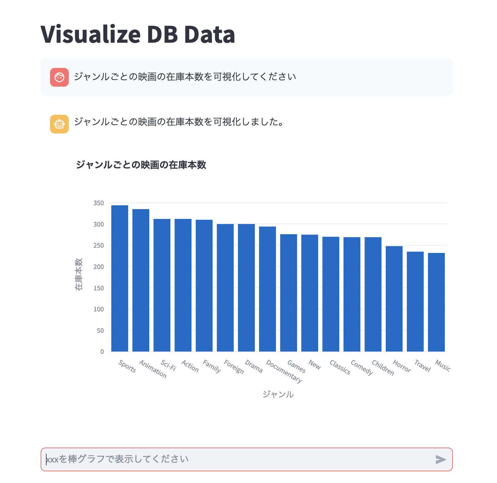

# Visualize DB Data with prompts



## Overview

Visualization of data in DB according to prompts entered in chat using GPT.  
* About DB engine, only sqlite is verified at this time.  

## Initial setup

Create a `.env` file according to the format of `.env.example`.

## How to start

```bash
streamlit run app.py --server.port 8080
```

## 概要

GPTを利用してチャットに入力したプロンプトに応じて、DB内のデータの可視化を実現します。  
※DBエンジンについて現時点ではsqliteのみ検証しています。  

## 初期設定

`.env.example` のフォーマットに従って `.env` ファイルを作成してください。

## 起動方法

```bash
streamlit run app.py --server.port 8080
```
